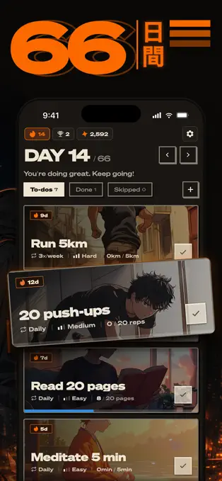
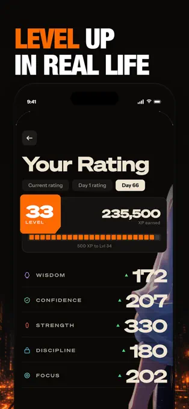

# Competitor screen and flow audit — expanded-scope addendum

**28 September 2026 · Research only.** Original audit retained below and [archived unchanged](research/archive/2026-09-25/COMPETITOR_SCREEN_AUDIT.md). This is a targeted expansion, not a repeat of all eight earlier products.

## Method and evidence labels

- **V — visually inspected published example:** opened official page in the browser and inspected rendered mobile screenshot pixels. It is not an installed-app walkthrough.
- **D — official documentation:** read owner-described behavior; do not infer exact current UI or usability.
- **H — inherited:** previously reported evidence from 25 September, not rechecked here.
- **U — unavailable:** no direct evidence; question remains open.

All new observations were made on 28 September 2026 using official public pages in a desktop browser. Phone images are promotional/help examples with unknown capture dates unless stated. No login, purchase, account creation, installed mobile testing or member testing occurred. Versions are listing/document labels, not proof that every screenshot depicts that version. Popularity and marketing claims are not efficacy evidence.

## New and refreshed product ledger

| Product / platform / version evidence | What was inspected | Visual/behavioral annotation and Safinat hypothesis | Unverified |
|---|---|---|---|
| **Life Reset: 66 Day Habit**, Savvy Tech Limited, iPhone listing **6.5.5** in live browser; search-index result showed older 6.5.3 | **V/D:** [official listing](https://apps.apple.com/us/app/life-reset-66-day-habit/id6478942469), first four promotional panels and release block | Dark illustrated task cards separate to-do/done/skipped and place checks on each task; another panel foregrounds level/XP. Borrow scannable components, not illustrated density or ratings. Description includes subscription, XP and missed-day penalties; these conflict with Safinat's free/dignified-return direction | Founder has not confirmed exact identity; existing study absent. Partial swipe, undo, Arabic, onboarding, paywall pixels, offline and lapse behavior untested. Do not claim the pictured cards prove swipe mechanics |
| **Ayah**, Arabic/English, iPhone/iPad; listing **28.0**, dated 21 March 2025 | **V/D:** [official listing](https://apps.apple.com/us/app/ayah-quran-app/id706037876), four opening panels and release text | Mushaf dominates the reading examples; appearance controls and a searchable reciter sheet appear separately. Hypothesis: keep practice text dominant and controls subordinate. Reader and reciter selection illustrate separate concerns, not evidence of automatic reading verification | No licensed asset reuse inferred. Exact assignment deep links, gesture behavior, page/text-size mapping, manual logging and current Arabic accessibility untested |
| **Athkar — أذكار**, fares.net; iPhone/iPad/Watch; listing **9.6.6**, Sep 18 | **V/D:** [official listing](https://apps.apple.com/us/app/athkar-%D8%A3%D8%B0%D9%83%D8%A7%D8%B1/id374050672), four opening panels | Arabic category lists use right-aligned labels and category colors; personal-adhkar panel uses wide labeled rows. Hypothesis: recognizable Arabic labels may support scanning; category color must remain distinct from completion. Do not import a many-feature home into quiet Today | Current counter correction, reminder defaults and free/paid boundaries untested. Accessibility features are developer-declared, not independently verified |
| **Udemy**, iOS/Android; app version not supplied by guide | **V/D:** [mobile notes help](https://support.udemy.com/hc/en-us/articles/360038537274-How-to-Create-And-Access-Notes-on-The-Mobile-App), published player/More/Notes image and top of creation view; [player help collection](https://support.udemy.com/hc/en-us/sections/4411124140951-Mobile-Course-Player) | Player above content tabs; Notes appears among More rows. Explicit authoring and return-to-lesson support review. For Safinat, coach-authored takeaways should be visible in lesson context; personal notes are a different scope. Notes in this example are learner-created | Quiz/assignment mobile pixels, Arabic layout, speed changes, offline and entitlement expiry not tested; no claim all guide images match current app |
| **Moodle app**, iOS/Android; app build unknown; docs route labeled **5.2**, feature page last edited May 2025, offline page April 2026 | **V:** [official download-page hero](https://download.moodle.org/mobile); **D:** [features](https://docs.moodle.org/502/en/Moodle_app_features), [offline](https://docs.moodle.org/502/en/Moodle_app_offline_features) | Hero shows course list/progress; floating assignment/offline labels are promotional overlays, not verified app controls. Documentation separates activities, assessment and sync. Hypothesis: classroom needs explicit draft/submitted/reviewed states and capability-specific offline behavior | No course login or mobile quiz attempt. Moodle teacher notes are not evidence for coach-authored learner takeaways. Offline quiz conditions are Moodle policy, not Safinat rules |
| **YouTube**, web/mobile help; product version unspecified | **D:** [transcripts](https://support.google.com/youtube/answer/15930243?hl=en), [embedded ads](https://support.google.com/youtube/answer/132596?hl=en), [embedding](https://support.google.com/youtube/answer/171780?hl=en) | Transcript lines can seek to the corresponding point when captions exist. Transfer contextual timestamps. Embedded playback can contain ads; privacy-enhanced mode is not an ad-free guarantee | No coach corpus, current mobile search flow, Arabic transcript accuracy, platform-wide transcript ranking or redistribution rights tested |
| **Telegram**, iOS/Android/web; current build unknown; historical update **23 February 2021** | **D:** [official update](https://www.telegram.org/blog/autodelete-inv2/ar?setln=en), [FAQ](https://www.telegram.org/faq) | Owner documents expiring/use-limited invite links and admin-controlled message auto-delete. Hypothesis: distinguish admission, membership, visibility and retention; none implies permission to broadcast a private reading log | Historical feature post, not current UI inspection; group exit, corrections, moderation, chat accessibility and revocation races untested |

The Life Reset candidate is provisional because similarly named products exist, including [LifeReset — Habit Tracker](https://play.google.com/store/apps/details?id=com.lifereset.app). No cross-product evidence is merged. The missing founder study remains a named dependency rather than something reconstructed from marketing.

## Inspectable annotated examples

These are existing third-party examples, **not Safinat screen proposals**. Original Life Reset images are retained without edits; attribution/source metadata accompanies them. Other images remain on their official source pages, with precise locators below.

### A. Life Reset — component rows and ratings

**A1, top:** day navigation and three status groups provide task context. **A2, middle:** row-local checks give an identifiable action. **A3, backgrounds/badges:** layered illustration, streaks and numerical rewards compete for attention. Safinat hypothesis: retain direct component action and remove unnecessary visible decisions; precise partial control still needs separate testing.

**A4, rating block:** large level/XP and attribute scores illustrate the risk of making the metaphor a score dashboard. Safina can display an approved semantic state without ranking spiritual worth. [Source listing](https://apps.apple.com/us/app/life-reset-66-day-habit/id6478942469); [original asset manifest](research/evidence/2026-09-28/life-reset-source-manifest.json). Neither image demonstrates a partial swipe or its correction behavior.

### B. Ayah — reading surface and separate controls

[Open official screenshots](https://apps.apple.com/us/app/ayah-quran-app/id706037876). Locate panels 1–4 in “iPhone App Previews and Screenshots.” **B1:** page text occupies most of the phone. **B2:** appearance and audio selection are separate surfaces. Test whether Safinat can open exact assignment positions without adding recording controls over scripture. These promotional views do not establish text integrity, source rights or live accessibility.

### C. Athkar — Arabic row hierarchy

[Open official screenshots](https://apps.apple.com/us/app/athkar-%D8%A3%D8%B0%D9%83%D8%A7%D8%B1/id374050672). Locate first category panel and fourth personal-adhkar panel. **C1:** Arabic labels align consistently at the right. **C2:** repeated row forms support scanning. **C3:** many category colors illustrate why commitment category and recorded status need independent semantics in Safinat. No contrast measurement or Arabic screen-reader test was performed on these images.

### D. Udemy — notes discoverability

[Open the illustrated mobile guide](https://support.udemy.com/hc/en-us/articles/360038537274-How-to-Create-And-Access-Notes-on-The-Mobile-App), image `notes_option_on_more_tab.png`. **D1:** player remains above Lectures/More. **D2:** Notes is a labeled row among several options. Hypothesis: retaining lesson context helps later review, but burying coach takeaways in a general menu may hinder Safinat's learning goal. Test discoverability; do not assume another app's menu depth works here.

### E. Moodle — course context and learning state

[Open official hero](https://download.moodle.org/mobile). **E1:** course cards convey membership in a learning space. **E2:** grade/submission and offline promotional callouts describe different states. Use that separation as a requirements prompt, not as a pixel-level claim about the live quiz UI.

## Coverage against the expanded brief

| Flow | Evidence available | Remaining task before a tested prototype |
|---|---|---|
| Welcome, goals, Today | **H:** Tarteel, Duolingo, Muslim Pro; **V:** Life Reset task example | Approved free/program choices, real daily load and Arabic comprehension |
| Reader/listener/physical path | **V:** Ayah; **H:** Tarteel/Muslim Pro external sessions | Assigned deep link, canonical position and source rights; audio policy |
| Partial/full log, same-day continuation, correction | **V:** component-check affordance only; **H/D:** external-session documentation | No verified competitor evidence for founder's exact partial-swipe mechanic; test it as a hypothesis |
| Ship, history, reminders, lapse | **H:** Finch/Streaks/Quran.com/Duolingo; **V:** Life Reset rating risk | Quiet acknowledgement, no-entry versus paused, months-later return and reminder opt-out |
| Dhikr | **V/D:** Athkar categories/custom-content reference | Self-chosen goal/count, decrement/reset protection and separate history |
| Classroom | **V:** Udemy/Moodle published examples; **D:** learning/offline capability | Real player/speed/captions, saved coach notes, MCQ/written response, assignment and feedback |
| Library | **D:** YouTube transcript seeking and embed constraints | Actual coach corpus, topic browse, relevance judgments, typo/empty/offline/unavailable source |
| Circles | **D:** Telegram admission/retention | Join/create, audience-specific consent, reactions, correction/deletion, moderation, exit and optional chat |
| Free/paid/settings/accessibility | Founder directions; product documentation/listing declarations only | No paywall tested; validate entitlement expiry, privacy, Arabic assistive tech, scale and offline |

New evidence supports separating reading, review, learning and social publishing. It does **not** establish behavior change, spiritual outcomes, a final navigation structure or a selected visual direction. Carry the original anti-patterns forward: public raw-volume rankings, paid streak repair, automatic reading credit from activity, binary partial logging and ship chores.

---

# Historical competitor audit — 25 September 2026

The dated observations below remain inherited evidence; only refreshed rows above have been re-inspected.

**Evidence date: 25 September 2026.** This is a desk audit of linked official screenshots, product walkthroughs, help pages and app listings. No product was installed, no signed-in flow was tested, and no usability outcome is inferred from popularity. “Observed” means visible in a published screen image or explicitly documented by its owner; documentation of a feature is **not** direct observation of its current mobile UI. Store listing version strings can change by region/device.

## Evidence ledger

| Product / platform / version | Published screen or flow evidence inspected | Observed and annotation | Unverified / fit hypothesis |
|---|---|---|---|
| [Tarteel](https://apps.apple.com/us/app/tarteel-ai-quran-memorization/id1391009396), iOS 5.81.6 listing; Android available, version unverified | Official [Goals](https://support.tarteel.ai/en/articles/12782033-how-do-i-use-the-goals-feature), [Today's Goals](https://support.tarteel.ai/en/articles/12414404-what-are-today-s-goals), [off-platform session](https://support.tarteel.ai/en/articles/12414408-how-to-add-an-off-platform-session) help | Owner describes range, portion and schedule goal; Today leads to portion; sessions can be added after reading outside app and on an earlier day. Multi-range target and separate actual session are useful for Safinat. | Embedded videos were not played or hands-on tested. Current placement, Arabic labels, correction, offline and accessibility unknown. Red missed/green complete bars may make a devotional lapse feel graded: test rather than copy. |
| [Quran.com Growth Journey](https://quran.com/product-updates/quran-reading-streaks), web update 2023, current mobile version unknown | Official linked goal images and product explanation | Goal choice by daily or duration; portions can be specified with surah/juz range; history and local-day reset are described. **Annotation:** range selection is a relevant data shape; a time goal cannot prove actual reading. | Images may describe an earlier web product. Current mobile screens, Arabic rendering, manual corrections and lapse return unknown. Do not import its adaptive portion or one-ayah streak rule. |
| [Quranly](https://apps.apple.com/us/app/quran-by-quranly/id1559233786), iOS 3.0.74 in listing; Android/version unknown | App Store listing and release notes; listing images exist but text retrieval did not expose reliable screen details | Release notes mention refreshed UI, themes, calendar/graph and Arabic; older notes mention community/leaderboard and streaks. This establishes candidate areas to inspect later, not pixel-level findings. | Onboarding, logging, Arabic screenshots, lapse behavior, accessibility and actual effectiveness unverified. Avoid leaderboard comparison of Qur’an volume. |
| [Muslim Pro](https://support.muslimpro.com/help/en/articles/how-to-plan-my-own-khatam), iOS/Android, version unverified | Official khatam guide, [Qur’an Read](https://helpdesk.muslimpro.com/help/en/articles/quran-read), [Qur’an quick actions](https://helpdesk.muslimpro.com/help/en/articles/quran-quick-actions-panel), [widget illustrations](https://helpdesk.muslimpro.com/help/en/articles/homescreen-updated-widget-android) | Owner says member may read in app or physical Qur’an and track plan; a Qur’an widget routes to last-read ayah/reader. **Annotation:** accommodate physical reading; a return shortcut can be helpful if it does not mark reading automatically. | Exact plan/log screen pixels, partial-range edit, visibility and Arabic accessibility unverified. Product spans many features; keep Safinat focused. |
| [Athkar — أذكار](https://apps.apple.com/us/app/athkar-%D8%A3%D8%B0%D9%83%D8%A7%D8%B1/id374050672), iPhone/iPad/Watch; version unverified | App Store listing images and description | Arabic/English categorized remembrance, font-size settings and customizable reminders are described. Listing images offer an Arabic-market reference, but could predate the current release. **Annotation:** test long labels and reading controls with Arabic members. | No installed flow, current screenshot transcription, settings reachability, lapse state or religious-copy validation for this program. |
| [Finch](https://apps.apple.com/us/app/finch-self-care-pet/id1528595748), iOS 3.73.210 listing; Android version unknown | Official [home guide](https://help.finchcare.com/hc/en-us/articles/37780000231309-Exploring-the-Finch-Home-Page) and listing images | Owner describes daily goals energizing a pet and unlocking adventure; tabs include Home, Quests, Shop, Friends, Bag. **Annotation:** a responsive companion can make accumulated effort tangible; side quests and shops would add chores before/after reading. | No tested onboarding, missed-day reaction, reminder, Arabic or accessibility flow. Pet mechanics do not establish devotional fit. |
| [Streaks](https://apps.apple.com/us/app/streaks/id963034692), iOS 11.4.1 listing on audit date | [Official product](https://streaksapp.com/) and listing | Scheduled non-daily tasks, compact completion and task statistics are described; Arabic is listed. **Annotation:** few taps and a visible schedule help a practiced member; binary completion cannot express partial ayah ranges or repeat acts. | No installed Arabic layout, actual tap count, lapse screen, older-user test or current settings audit. The chain-breaking premise is a poor default for re-entry. |
| [Duolingo](https://blog.duolingo.com/duolingo-101-how-to-learn-a-language-on-duolingo/), iOS/Android; current app version unverified | Official illustrated walkthrough contains mobile images for course selection, starting level, reminder preference, learning path and settings; [design blog](https://blog.duolingo.com/core-tabs-redesign/) publishes alternate quests/leaderboard/profile compositions | **Annotation of published screen examples:** (1) onboarding splits subject, level and reminder choices; transfer a brief load-aware commitment choice. (2) Path screens foreground one next lesson; transfer one next reading action. (3) Quest/leaderboard screens devote space to points, friends and streaks; do not transfer them to worship. | Screens may predate current releases. No live route, Arabic design, assistive-technology or efficacy test. Its [streak freeze](https://blog.duolingo.com/protecting-streaks-from-site-issues/) illustrates a loss-and-repair economy to avoid here. |

## Flow coverage and gaps

| Flow | Evidence found | Still needs direct mobile inspection |
|---|---|---|
| Onboarding / goal load | Duolingo official pictured walkthrough; Tarteel goal guide; Muslim Pro khatam guide | Coach-specific tiers and realistic burden; Arabic comprehension; adjustable commitment |
| Today / next action | Tarteel Today guide; Duolingo path pictures; Muslim Pro widget illustration | Multi-component exact range scanning on smaller Arabic phones |
| Reading and actual log | Tarteel off-platform session guide; Muslim Pro physical Qur’an policy | Full/partial/repeat/correction/late duplicate path on real devices |
| Progress / acknowledgement | Quran.com history update; Finch home guide; Streaks statistics; Duolingo quest pictures | Does a quiet ship change feel meaningful, truthful and noncompetitive? |
| Reminder / lapse / return | Duolingo walkthrough and streak-freeze explanation; Streaks scheduling; Athkar listing settings | Months-later return, paused day, pressure, notification opt-out, corrections |
| Settings / accessibility / offline | Athkar font option, Tarteel/Muslim Pro documentation; Duolingo settings images | VoiceOver/TalkBack, 200% text, reduced motion, actual offline reconciliation |

## Comparative judgment

- **Transfer:** explicit goal and actual-session separation (Tarteel); physical reading recognized (Muslim Pro); one obvious next action (Duolingo path); a companion state as passive acknowledgement (Finch); compact daily interaction (Streaks).
- **Avoid or challenge:** public raw-volume comparison, monetized streak repair, red failure bars, binary “done” for an incomplete passage, automatic completion from app activity, and a side economy of ship chores.
- **Evidence boundary:** published product screens show visual choices, not causal behavioral impact. App versions and layouts change. Before selecting a visual direction, inspect current Arabic iOS and Android builds with legitimate access, capture the same task flow in each, and record screen date, device, locale and account state. No interviews occurred at this gate.
